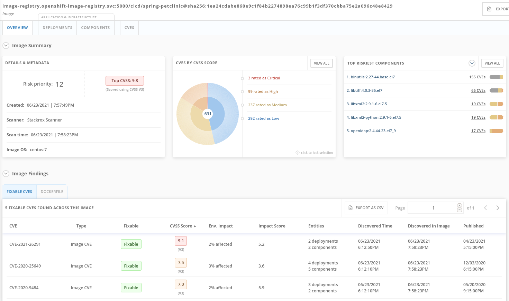

# DevSecOps Pipeline Demo 

DevSecOps CICD pipeline demo using several technologies such as:

- [Openshift Pipelines](https://www.openshift.com/learn/topics/ci-cd)
- [Openshift GitOps](https://www.openshift.com/blog/announcing-openshift-gitops)
- [Openshift Advanced Cluster Security for Kubernetes](https://www.redhat.com/en/resources/advanced-cluster-security-for-kubernetes-datasheet)
- [Openshift Container Registry](https://docs.openshift.com/container-platform/latest/registry/architecture-component-imageregistry.html)
- [SonarQube](https://www.sonarqube.org/)
- [Nexus](https://www.sonatype.com/products/repository-oss?topnav=true)
- [JUnit](https://junit.org/junit5/)
- [Gogs](https://gogs.io/) 
- [Git Webhook](https://tekton.dev/docs/triggers/)
- [Gatling](https://gatling.io/)
- [Zap Proxy](https://www.zaproxy.org/)

## Prerequisites 

- Openshift Cluster 4.7+
- Ansible 2.7+

# Overview

## 1. Continuous Integration

On every push to the spring-petclinic git repository on Gogs git server, the following steps are executed within the Tekton pipeline:


0. [Code is cloned](docs/Steps.md#source-clone) from Gogs git server and the unit-tests are run
1. [Dependency report](docs/Steps.md#dependency-report) from the source code is generated and uploaded to the report server repository.
2. [Unit tests](docs/Steps.md#unit-tests) are executed and in parallel the code is [analyzed by Sonarqube](docs/Steps.md#code-analysis-sonarqube) for anti-patterns.
3. Application is packaged as a JAR and [released to Sonatype Nexus](docs/Steps.md#release-app) snapshot repository
4. A [container image is built](docs/Steps.md#build-image) in DEV environment using S2I, and pushed to OpenShift internal registry, and tagged with spring-petclinic:[branch]-[commit-sha] and spring-petclinic:latest

## 2. DevSecOps steps using Advanced Cluster Management

Advanced Cluster Management for Kubernetes controls clusters and applications from a single console, with built-in security policies.

Using roxctl and ACS API, we integrated in our pipeline several additional security steps into our DevSecOps pipeline:

5. [Image Scanning using ACS Scanner](docs/Steps.md#image-scan) of the image generated and pushed in step 4.



6. [Image Check](docs/Steps.md#image-check) of the build-time violations of the different security policies defined in ACS
7. [Checks build-time and deploy-time violations](docs/Steps.md#deployment-check) of security policies in ACS of the YAML deployment files used for deploy our application.


NOTE: these 3 steps are executed in parallel for saving time in our DevSecOps pipeline.

8. Kubernetes [kustomization files updated](docs/Steps.md#update-deployment) with the latest image [commit-sha] in the overlays for dev. This will ensure that our Application are deployed using the specific built image in this pipeline.


## 3. Continuous Delivery

Argo CD continuously monitor the configurations stored in the Git repository and uses Kustomize to overlay environment specific configurations when deploying the application to DEV and STAGE environments.


9. The ArgoCD applications syncs the manifests in our gogs git repositories, and applies the changes automatically into the namespaces defined:


and deploys every manifest that is defined in the branch/repo of our application:


## 4. PostCI - Pentesting and Performance Tests

Once our application is deployed, we need to ensure of our application is stable and performant and also that nobody can hack our application easily. 

10. Our CI in Openshift Pipelines [waits until the ArgoCD app is fully sync](docs/Steps.md#wait-application) and our app and all the resources are deployed 
11. The [performance tests are cloned](docs/Steps.md#performance-tests-clone) into our pipeline workspace
12. The [pentesting is executed](docs/Steps.md#pentesting-tests-using-zap-proxy) using the web scanner [OWASP Zap Proxy](https://www.zaproxy.org) using a baseline in order to check the possible vulnerabilities, and a Zap Proxy report is uploaded to the report server repository.
13. In parallel the [performance tests are executed](docs/Steps.md#performance-tests-using-gatling) using the load test [Gatling](https://gatling.io/) and a performance report is uploaded to the report server repository.

## 5. Notifications

ACS can be integrated with several Notifier for notify if certain events happened in the clusters managed. In our case, we integrated with Slack in order to receive notifications when some Policies are violated in order to have more useful information:


These policies notification can be enabled by each system policy enabled in our system, so you can create your own notification baseline in order to have only the proper information received in your systems.

NOTE: By now the integration is manual. WIP to automate it.

## Security Policies and CI Violations

In this demo, we can control the security policies applied into our pipelines, scanning the images and analysing the different deployments templates used for deploy our applications. 

We can enforce the different Security Policies in ACS, failing our CI pipelines if a violation of this policy appears in each step of our DevSecOps pipelines (steps 6,7,8).

This Security Policies can be defined at BUILD level (during the build/push of the image), or at DEPLOYMENT level (preventing to deploy the application).

For example this Security Policy, checks if a RH Package Manager (dnf,yum) is installed in your Image, and will FAIL the pipeline if detects that the image built contains any RH Package Manager:


This ensures that we have the total control of our pipelines, and no image is pushed into your registry or deployed in your system that surpases the Security Policies defined.

# Deploy 

## Bootstrap

Fully automated deployment and integration of every resource and tool needed for this demo.

```
cd bootstrap
./install.sh
```

IMPORTANT: this is a working progress, be aware that some parts could not work as expected. PR are welcome :)

## Credentials & Resources

Check the resources deployed for this demo with:

```
./status.sh
```

- Gogs git server (username/password: gogs/gogs)
- Sonatype Nexus (username/password: admin/admin123)
- SonarQube (username/password: admin/admin)
- Argo CD (username/password: admin/[Login with OAuth using Dex])
- ACS (username/password: admin/stackrox)
- Repository Server (username/password: reports/reports)

## Run the demo!

```
cd ..
./demo.sh start
```

NOTE: This pipeline will fail if you don't [disable the "Fixable CVSS >= 7"](docs/disable_policy_enforcement.md) policy enforcement behaviour of ACS. This is expected to demonstrate the failure when a violation of the system policy occurs.  

## Quick Video with the Demo 

* [Option I - Complete CICD End2End process (Success)](https://youtu.be/uA7nUYchY5Q)

* [Option II - Failure CICD pipeline due to the ACS violation policy](https://youtu.be/jTRImofd6wQ?t=380)

## Promote Pipeline and Triggers

* [Promote Pipeline](docs/promote.md)
* [Triggers in Dev Pipeline](doc/triggers.md)

# Credits

This repo is heavily based in the [CICD repository](https://github.com/siamaksade/openshift-cicd-demo) and work of Siamak Sadeghianfar. Kudos to Siamak!

Big thanks also to [Rodrigo Alvares](https://github.com/ralvares) that helped with their wisdom and knowledge in this demo.

## TODO

- Improve automation and bootstraping scripts
- Add documentation about triggers
- Add better branching with GitHub Flow model
- Update images for the infra (nexus, gogs, etc) with the latest versions