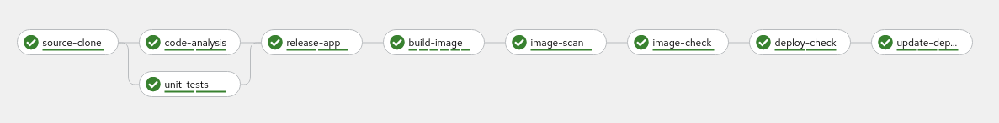
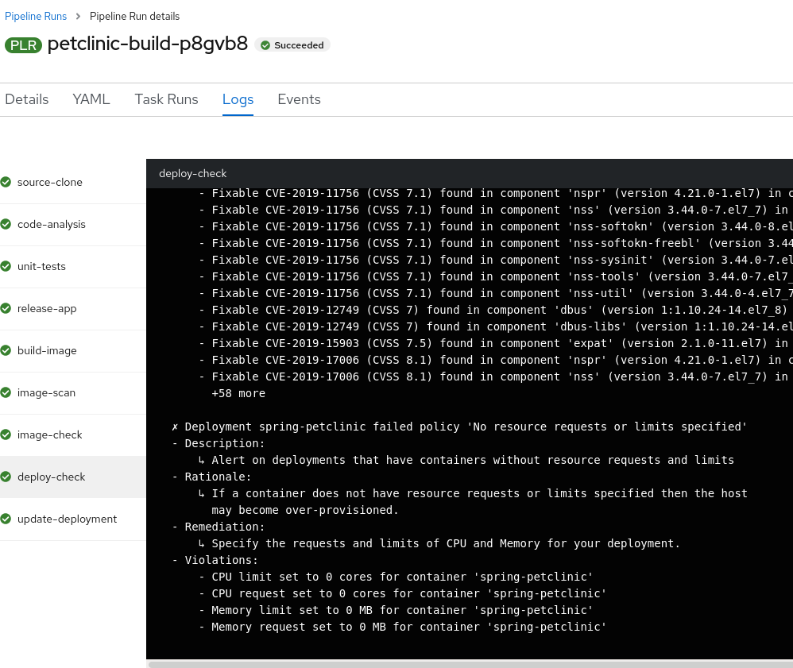
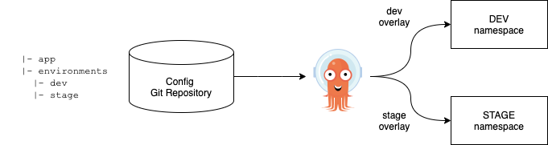
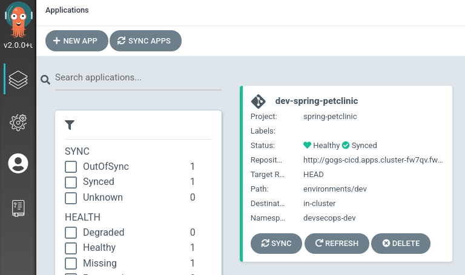
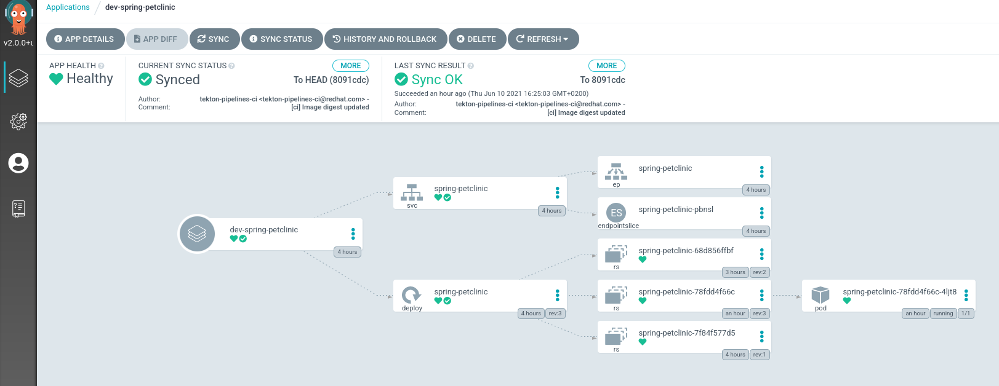
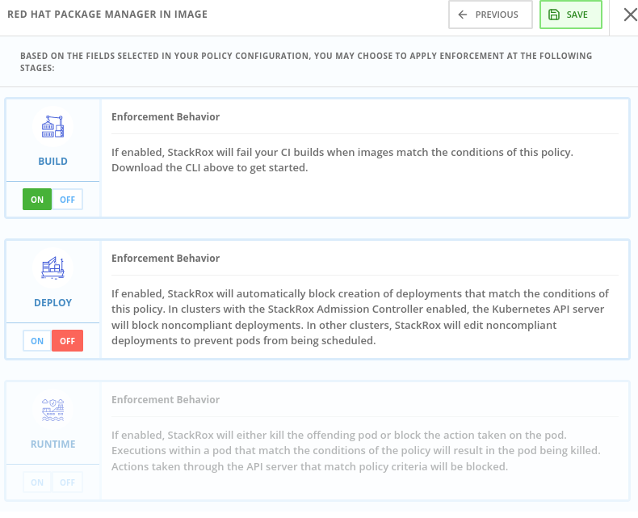

# DevSecOps Pipeline Demo

DevSecOps CICD pipeline demo using several technologies such as:

- Openshift Pipelines (based in Tekton)
- Openshift GitOps (based in ArgoCD)
- Openshift Advanced Cluster Security for Kubernetes (former StackRox)
- Openshift Container Registry
- SonarQube
- Nexus
- JUnit
- Gogs 
- Git Webhook

## Prerequisites 

- Openshift Cluster 4.7+

## Continuous Integration

On every push to the spring-petclinic git repository on Gogs git server, the following steps are executed within the Tekton pipeline:



1. [Code is cloned](docs/Steps.md#source-clone) from Gogs git server and the unit-tests are run
2. Unit tests are executed and in parallel the code is analyzed by SonarQube for anti-patterns
3. Application is packaged as a JAR and released to Sonatype Nexus snapshot repository
4. A container image is built in DEV environment using S2I, and pushed to OpenShift internal registry, and tagged with spring-petclinic:[branch]-[commit-sha] and spring-petclinic:latest
5. Kubernetes manifests and performance tests configurations are cloned from Git repository

## DevSecOps steps using Advanced Cluster Management

Advanced Cluster Management for Kubernetes controls clusters and applications from a single console, with built-in security policies.

Using roxctl and ACS API, we integrated in our pipeline several additional security steps into our DevSecOps pipeline:

6. Image Scanning using ACS Scanner of the image generated and pushed in step 4.
7. Image Check of the build-time violations of the different security policies defined in ACS
8. Checks build-time and deploy-time violations of security policies in ACS of the YAML deployment files used for deploy our application.



10. Kubernetes kustomization files updated with the latest image [commit-sha] in the overlays for dev. This will ensure that our Application are deployed using the specific built image in this pipeline.

## Continuous Delivery

Argo CD continuously monitor the configurations stored in the Git repository and uses Kustomize to overlay environment specific configurations when deploying the application to DEV and STAGE environments.



9. The ArgoCD applications syncs the manifests in our gogs git repositories, and applies the changes automatically into the namespaces defined:



and deploys every manifest that is defined in the branch/repo of our application:



## Security Policies and CI Violations

In this demo, we can control the security policies applied into our pipelines, scanning the images and analysing the different deployments templates used for deploy our applications. 

We can enforce the different Security Policies in ACS, failing our CI pipelines if a violation of this policy appears in each step of our DevSecOps pipelines (steps 6,7,8).

This Security Policies can be defined at BUILD level (during the build/push of the image), or at DEPLOYMENT level (preventing to deploy the application).

For example this Security Policy, checks if a RH Package Manager (dnf,yum) is installed in your Image, and will FAIL the pipeline if detects that the image built contains any RH Package Manager:



This ensures that we have the total control of our pipelines, and no image is pushed into your registry or deployed in your system that surpases the Security Policies defined.

# Deploy 

## Bootstrap

Fully automated deployment and integration of every resource and tool needed for this demo.

```
cd bootstrap
bash -x install.sh
```

NOTE: this is a working progress, be aware that some parts could not work as expected. PR are welcome :)

## Credentials

- Gogs git server (username/password: gogs/gogs)
- Sonatype Nexus (username/password: admin/admin123)
- SonarQube (username/password: admin/admin)
- Argo CD (username/password: admin/[Login with OAuth using Dex])
- ACS (username/password: admin/stackrox)

## Run the demo!

```
cd bootstrap
bash -x demo.sh
```

# Credits

This repo is heavily based in the [CICD repository](https://github.com/siamaksade/openshift-cicd-demo) and work of Siamak Sadeghianfar. Kudos to Siamak!

# TODO in this Demo Repositoy

- Improve automation and bootstraping scripts
- Add better branching with GitHub Flow model
- Add the Report Repo to upload the tests
- Add the dependency graphs
- Integrate Performance Tests (Gatling)
- Add some compliance report (Openscap? Openshift-compliance Operator?)
- Add pentesting using [OWASP Zap Proxy](https://www.zaproxy.org/docs/docker/about/)