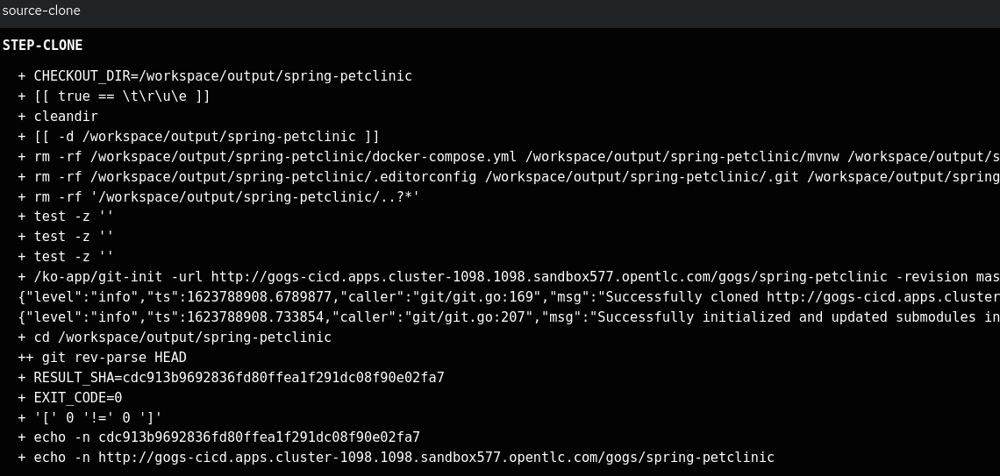

## Source Clone

-

NOTE:

## Code Analysis (Sonarqube)

NOTE:

## Unit Tests 

-

NOTE:

## Code Analysis

-

NOTE:

## Release App

-

NOTE:

## Build Image

-

NOTE:

## Image Scan

-

-

NOTE:

## Image Check

* Fail CI due to a policy

* Non Failing (just Warning)

## Deployment Check

* Fail CI due to a Deployment Policy

* Non Failing (just Warning)

## Update Deployment

