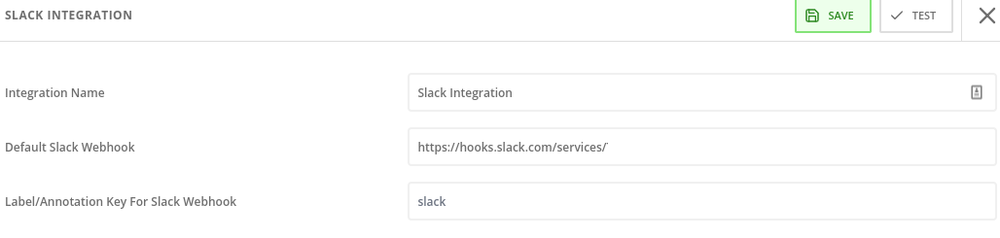
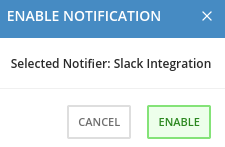

## Slack Integration

* Based in the official [Integrate with Slack](https://help.stackrox.com/docs/integrate-with-other-tools/integrate-with-slack/) documentation in Stackrox

1. Create a Slack App, enable Incoming Webhooks and get the Webhook URL

2. Configure the Stackrox Kubernetes Security Platform

3. Enable the Notifications in the system policies

Platform Configuration -> System Policies -> Select Policy -> Actions -> Enable Slack Notifications

